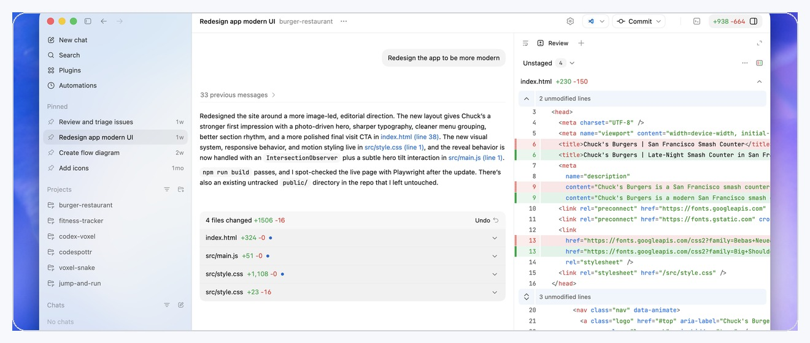

<h1 align="center">Codex Help</h1>

  面向开发者的 OpenAI Codex 非官方使用指南：快速入门、核心工作流、安全边界、配置方式和实用技巧。

  <a href="README.md">English</a>
  ·
  <strong>中文</strong>

  

## 在线阅读

| 入口 | 说明 |
| --- | --- |
| [中文版教程 - 网页导航版](https://xenosxu1-bot.github.io/Codex_Help/zh-CN.html) | 推荐中文阅读入口，左侧带章节目录，方便快速跳转。 |
| [中文 Markdown 原文](docs/zh-CN.md) | 适合在 GitHub 中直接阅读、复制或二次编辑。 |

## 你可以学到什么

- Codex 是什么，适合处理哪些开发任务。
- 如何选择 Codex App、CLI、IDE Extension、Cloud、GitHub、Slack 和 Linear。
- 如何写包含目标、上下文、约束和完成标准的高质量提示词。
- 如何使用 Plan mode、Goal mode、threads、worktrees 和 review。
- 如何配置 `config.toml`、`AGENTS.md`、Skills、Plugins、MCP、Hooks、Rules、Automations 和 Subagents。

## 仓库结构

| 路径 | 作用 |
| --- | --- |
| `README.md` | 英文项目首页。 |
| `README.zh-CN.md` | 中文项目首页。 |
| `docs/zh-CN.md` | 中文完整教程 Markdown 原文。 |
| `docs/en-US.md` | 英文完整教程 Markdown 原文。 |
| `docs/zh-CN.html` | 中文网页导航版教程，左侧带章节目录。 |
| `docs/en-US.html` | 英文网页导航版教程，左侧带章节目录。 |
| `assets/images/` | Markdown 教程和 README 使用的截图资源。 |
| `docs/assets/images/` | GitHub Pages 网页版使用的截图资源。 |
| `tools/generate_pages.py` | 将 Markdown 教程生成带左侧目录的 HTML 页面。 |
| `docs/source-check.md` | 官方文档刷新和校验说明。 |

## 官方文档

本仓库是学习辅助材料，不替代官方文档。建议结合以下官方页面阅读：

- [Codex overview](https://developers.openai.com/codex/overview)
- [Codex prompting](https://developers.openai.com/codex/prompting)
- [Codex workflows](https://developers.openai.com/codex/workflows)
- [Codex App](https://developers.openai.com/codex/app)
- [Codex CLI](https://developers.openai.com/codex/cli)
- [Codex IDE Extension](https://developers.openai.com/codex/ide)
- [Configuration](https://developers.openai.com/codex/config-basic)
- [Agent approvals and security](https://developers.openai.com/codex/agent-approvals-security)
- [AGENTS.md](https://developers.openai.com/codex/guides/agents-md)
- [Skills](https://developers.openai.com/codex/skills)
- [Plugins](https://developers.openai.com/codex/plugins)
- [MCP](https://developers.openai.com/codex/mcp)

来源校验：[docs/source-check.md](docs/source-check.md)

## 许可

本仓库原创教程文本采用 MIT License。OpenAI 产品名称、商标、官方文档和截图仍受其各自权利方条款约束。
