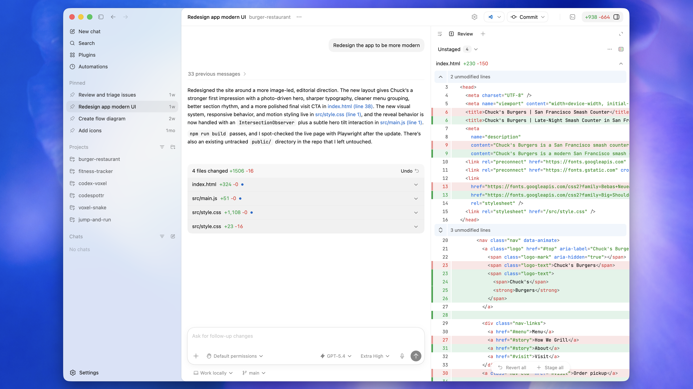
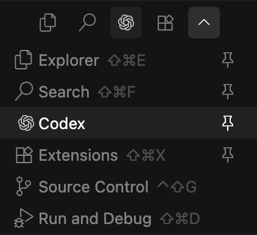
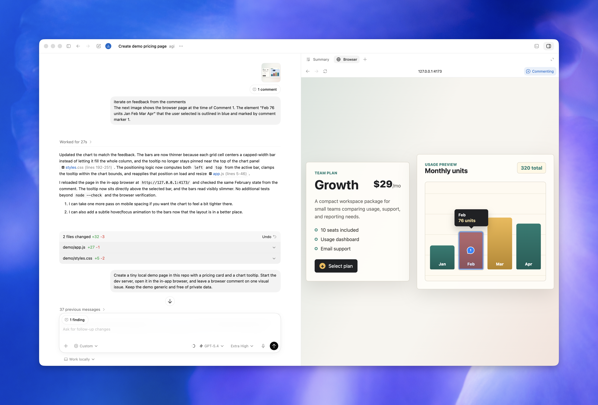
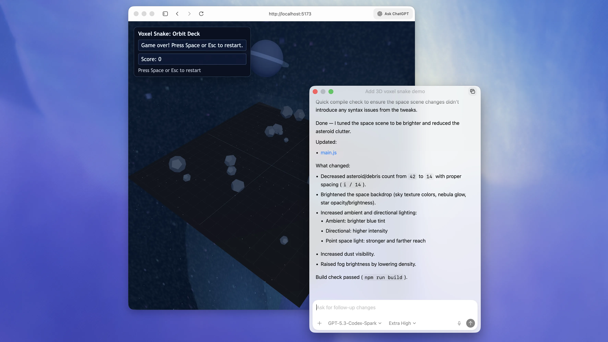
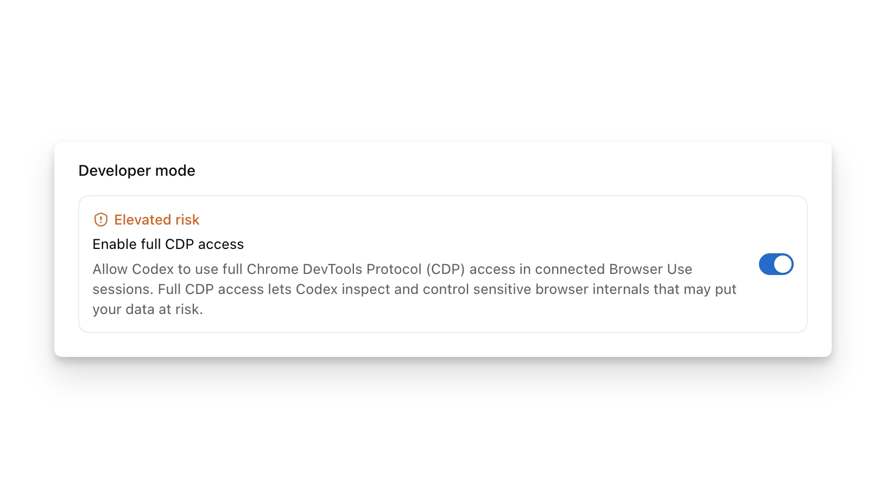

# Codex 主要功能与使用技巧中文教程

> 版本说明：本文是非官方学习教程，根据 OpenAI Codex 官方手册整理，资料抓取时间为 2026-07-08。Codex 功能、模型、套餐和成熟度标签会随产品更新而变化，涉及价格、可用模型、企业策略时请以官方页面为准。

## 目录

- [1. Codex 是什么](#1-codex-是什么)
- [2. 你可以用 Codex 做什么](#2-你可以用-codex-做什么)
- [3. 选择合适的使用入口](#3-选择合适的使用入口)
- [3.1 Codex 界面图速览](#31-codex-界面图速览)
- [4. 第一次使用的推荐流程](#4-第一次使用的推荐流程)
- [5. 写好提示词：让 Codex 更稳定](#5-写好提示词让-codex-更稳定)
- [6. 常见工作流范例](#6-常见工作流范例)
- [7. 线程、上下文、Plan mode 与 Goal mode](#7-线程上下文plan-mode-与-goal-mode)
- [8. 权限、沙箱与安全](#8-权限沙箱与安全)
- [9. 配置文件 config.toml](#9-配置文件-configtoml)
- [10. 模型、推理强度与速度](#10-模型推理强度与速度)
- [11. Codex App 使用技巧](#11-codex-app-使用技巧)
- [12. Codex CLI 使用技巧](#12-codex-cli-使用技巧)
- [13. IDE 扩展使用技巧](#13-ide-扩展使用技巧)
- [14. Cloud、GitHub、Slack 与 Linear](#14-cloudgithubslack-与-linear)
- [15. AGENTS.md：把项目规则写给 Codex](#15-agentsmd把项目规则写给-codex)
- [16. Skills：复用任务工作流](#16-skills复用任务工作流)
- [17. Plugins：分发技能、MCP 与集成](#17-plugins分发技能mcp-与集成)
- [18. MCP：连接外部工具和私有上下文](#18-mcp连接外部工具和私有上下文)
- [19. Hooks、Rules 与团队治理](#19-hooksrules-与团队治理)
- [20. 自动化、子代理与长任务](#20-自动化子代理与长任务)
- [21. Windows 使用建议](#21-windows-使用建议)
- [22. 实战提示词模板](#22-实战提示词模板)
- [23. 排错清单](#23-排错清单)
- [24. 官方资料索引](#24-官方资料索引)

## 1. Codex 是什么

Codex 是 OpenAI 面向软件开发的 coding agent。它不是只回答问题的聊天助手，而是可以读取项目、编辑文件、运行命令、分析错误、写测试、审查 diff，并在需要时调用外部工具的开发协作者。

官方定位里，Codex 主要覆盖这些能力：

- 写代码：根据你的意图生成代码，并尽量贴合现有项目结构和风格。
- 理解代码库：阅读复杂或遗留项目，解释模块职责、调用链、数据流和风险点。
- 代码审查：识别潜在 bug、逻辑错误、遗漏边界条件和高风险改动。
- 调试修复：根据复现步骤、日志和测试失败定位原因并提交补丁。
- 自动化开发任务：执行重构、迁移、测试、环境检查、报告生成等重复流程。

一个实用的理解方式是：Codex 最适合承担“可以被验证的开发任务”。你给它目标、上下文、约束和完成标准，它负责探索、修改、验证、汇报。

## 2. 你可以用 Codex 做什么

### 代码生成与功能实现

适合任务：

- 新增页面、接口、命令行参数或组件。
- 按现有模式补齐业务逻辑。
- 从设计稿、截图或需求说明实现原型。
- 添加错误处理、边界条件和空状态。

建议让 Codex 先读取相邻文件、现有测试和项目约定。不要只说“加一个功能”，最好告诉它功能入口、期望行为、不能改动的接口和验证方式。

### 代码理解与系统梳理

适合任务：

- 新人上手一个仓库。
- 弄清请求链路、状态流、数据模型和依赖关系。
- 解释某个函数为什么这样写。
- 找出修改某个模块可能影响哪些地方。

技巧：让 Codex 输出“文件列表 + 调用链 + 风险点 + 建议阅读顺序”。这比单纯让它“解释代码”更容易落到可验证的结构。

### Debug 与故障修复

适合任务：

- 修复失败测试。
- 复现 UI 或接口 bug。
- 分析堆栈、日志、CI 输出。
- 处理依赖升级后的破坏性变化。

高质量 bug prompt 应包含：

- 现象：用户看到什么，系统哪里不对。
- 复现步骤：如何稳定触发。
- 期望行为：正确结果是什么。
- 约束：哪些 API、数据结构或兼容行为不能变。
- 验证：修完后要跑哪些测试或手工检查。

### 测试与质量检查

Codex 可以：

- 补单元测试、集成测试、回归测试。
- 运行 lint、format、typecheck、test。
- 根据失败输出继续修复。
- 做本地 diff review，给出优先级明确的问题列表。

建议在任务结尾明确写：“完成后运行最小相关测试，并报告命令和结果。”

### 代码审查

Codex 的 review 模式适合在提交前查：

- 正确性问题。
- 回归风险。
- 安全问题。
- 缺失测试。
- 可维护性问题。

在 CLI 中可用 `/review`，在 Codex App 中可用 diff/review 面板，也可以在 GitHub PR 中通过 `@codex review` 触发云端审查。

### 非代码文件与交付物

在 Codex App 中，Codex 可以预览或生成 PDF、表格、文档、演示文稿等非代码产物。给这类任务时要说明：

- 输出文件类型。
- 内容结构。
- 格式要求。
- 检查标准。
- 保存位置。

## 3. 选择合适的使用入口

Codex 主要有几种使用形态。选择哪个入口，取决于你要做的任务和上下文在哪里。

| 入口 | 适合场景 | 主要优势 | 注意事项 |
| --- | --- | --- | --- |
| Codex App | 桌面端多线程工作、可视化 review、工作树、自动化、浏览器预览 | 图形界面、并行任务、Git 工具、内置终端、浏览器和 artifact 预览 | 非代码研究也可用 projectless chat |
| CLI | 终端开发、脚本化、远程机器、CI 风格任务 | 快、可组合、适合 `codex exec` 自动化 | 需要更明确地给文件路径和命令上下文 |
| IDE 扩展 | 边看代码边提问、选中代码解释、编辑器内修改 | 自动带入打开文件和选中代码，适合短反馈循环 | 注意 IDE context 是否开启 |
| Cloud | 并行、异步、远程执行、从 Slack/Linear/GitHub 委派任务 | 不占本机，适合多个任务同时跑 | 需要 GitHub 仓库和 cloud environment |
| GitHub 集成 | PR 审查、PR 修复 | 在 PR 里直接 `@codex review` 或 `@codex fix...` | 需要启用 Codex cloud 和代码审查设置 |
| Slack/Linear | 从协作工具委派任务 | 少切换上下文，适合团队流程 | 需要连接器和环境配置 |

简单判断：

- 正在编辑代码：优先 IDE 扩展或 App。
- 想在终端快速做事：用 CLI。
- 想跑长任务或并行多个方案：用 Cloud 或 App worktree。
- 想让它审 PR：用 GitHub 集成或本地 `/review`。
- 想把重复流程产品化：用 Skills 或 Plugins。

## 3.1 Codex 界面图速览

这一节放几张官方界面图，帮助你把后面提到的 App、CLI、IDE、浏览器预览、自动化和 artifact 预览对应到真实界面。图片文件已下载到本文同目录下的 `../assets/images/` 文件夹，离线打开 Markdown 时也能查看。

### Codex App：线程、任务与代码审查界面



Codex App 是桌面端主工作台。左侧用于管理项目和线程，中间是对话和任务过程，右侧可以显示 diff、review、文件预览或相关上下文。适合多线程开发、查看 Codex 改动、加行内反馈、提交和推送代码。

来源：[Codex App](https://developers.openai.com/codex/app)

### Codex CLI：终端里的交互式 agent


CLI 适合终端用户、远程环境、脚本化任务和非交互执行。它可以在 TUI 中展示计划、命令、diff、审批提示和最终结果，也可以通过 `codex exec` 直接跑一次性任务。

来源：[OpenAI Codex GitHub repository](https://github.com/openai/codex)

### Codex IDE Extension：编辑器侧边栏与代码上下文



IDE 扩展把 Codex 放进 VS Code 兼容编辑器。它能利用打开文件、选中代码和编辑器上下文，因此适合“边看代码边问”“选中一段让它解释/修改”“从 TODO 直接生成实现”等短反馈循环。

来源：[Codex IDE Extension](https://developers.openai.com/codex/ide)

### In-app Browser：本地页面预览和浏览器操作



In-app browser 适合预览本地开发服务器、检查页面布局、让 Codex 操作页面做 UI 验证。它和你的常规浏览器 profile 隔离，不共享登录态、cookies、扩展或已打开标签。

来源：[In-app browser](https://developers.openai.com/codex/app/browser)

### Browser Comments：在页面上标注具体反馈


浏览器评论可以把反馈绑定到页面区域。做前端时，你可以在按钮、卡片、表单或布局错位处直接标注，再让 Codex 根据这些可视化反馈修改代码。

来源：[In-app browser](https://developers.openai.com/codex/app/browser)

### Artifact Viewer：预览文档、表格、PDF 和演示稿


Codex App 可以预览非代码产物，例如 PDF、文档、表格和演示文稿。适合让 Codex 生成报告、整理表格、制作材料，并在同一工作区内检查结果。

来源：[Codex App features](https://developers.openai.com/codex/app/features)

### Automations：定时或周期性任务


Automations 用于周期性检查、提醒、监控或后续工作。若任务依赖当前 thread 的上下文，使用 thread automation；若希望每次新开任务，使用独立或项目自动化。

来源：[Codex Automations](https://developers.openai.com/codex/app/automations)

### Floating Pop-out：把当前线程悬浮到工作区旁边



浮动窗口适合前端、桌面 app 或设计调试。你可以把 Codex 放在浏览器、编辑器或预览窗口旁边，边看结果边继续给反馈。

来源：[Codex App features](https://developers.openai.com/codex/app/features)

### Browser Developer Mode：更深入的浏览器调试



浏览器 Developer mode 可启用更完整的 Chrome DevTools Protocol 访问，用于性能分析和更深层的浏览器调试。它扩大了能力边界，团队环境中可能受管理员策略限制。

来源：[In-app browser](https://developers.openai.com/codex/app/browser)

## 4. 第一次使用的推荐流程

### 第一步：从仓库根目录启动

CLI：

```bash
cd path/to/your-repo
codex
```

Codex App：添加项目时选择仓库根目录。

IDE：打开仓库根目录，并确保 Codex 扩展连接的是当前 workspace。

### 第二步：先让 Codex 认识项目

可以这样问：

```text
请先阅读这个项目的结构，找出构建、测试、lint 命令，以及主要源码目录。
不要修改文件。最后给我一份上手摘要和你建议写入 AGENTS.md 的项目规则。
```

### 第三步：生成或完善 AGENTS.md

CLI 中可用：

```text
/init
```

然后让 Codex 根据真实项目补充：

```text
请基于 package.json、README、测试目录和现有 CI，完善 AGENTS.md。
重点写清楚：项目结构、常用命令、代码风格、测试要求、不要做的事。
```

### 第四步：从小而可验证的任务开始

不要一上来让 Codex “重构整个系统”。先让它做一个可以测试的小任务：

```text
修复这个失败测试：<粘贴错误>
约束：不要改变公开 API。
完成后运行这个测试文件，并解释根因。
```

### 第五步：养成“实现 + 验证 + review”的闭环

每个任务尽量包含：

- 实现或修复。
- 运行相关检查。
- 查看 diff。
- 让 Codex 自审一次。
- 你再人工确认。

## 5. 写好提示词：让 Codex 更稳定

官方最佳实践建议，一个好 prompt 通常包含四类信息：

1. Goal：你要改变或构建什么。
2. Context：哪些文件、错误、截图、设计、日志相关。
3. Constraints：架构、安全、兼容性、风格、不能改的地方。
4. Done when：什么条件代表完成，比如测试通过、bug 不再复现、UI 达到截图效果。

### 好 prompt 的基本格式

```text
目标：
<一句话说明要完成什么>

上下文：
- 相关文件：@src/foo.ts @src/foo.test.ts
- 当前问题：<错误、日志、截图或行为>
- 现有约定：<项目模式或文档>

约束：
- 不改变公开 API
- 不引入新依赖，除非先说明原因
- 保持现有代码风格

完成标准：
- 添加或更新测试
- 运行 <具体命令>
- 最后汇报改了什么、如何验证
```

### 任务越复杂，越应该先计划

适合先 `/plan` 的情况：

- 需求模糊。
- 涉及多个模块。
- 可能需要迁移数据或升级依赖。
- 修改有安全或兼容风险。
- 你还没决定方案。

示例：

```text
/plan 我想把这个服务的配置加载逻辑从环境变量散落读取，改成集中 schema 校验。
请先调查现状，列出迁移步骤、风险、测试策略。先不要改文件。
```

### 让 Codex 采访你

当你只有模糊想法时，可以直接说：

```text
我有个模糊需求：想改善这个 dashboard 的性能。
先不要写代码。请先问我最多 8 个关键问题，帮我把目标、指标、范围和验收标准具体化。
```

### 明确验证方式

Codex 在能验证时通常表现更好。可以写：

```text
完成后请运行：
- npm run lint
- npm test -- src/foo.test.ts
如果某个命令失败，先判断是否与你的改动有关，再决定是否修复。
```

## 6. 常见工作流范例

### 解释代码库

```text
请阅读这个仓库，解释一个请求从入口到数据库的完整链路。
输出：
1. 关键文件和职责
2. 请求流步骤
3. 数据校验发生在哪里
4. 修改这条链路时最容易踩的坑
```

### 修复 bug

```text
Bug：设置页点击 Save 后显示保存成功，但刷新后开关恢复原值。

复现：
1. npm run dev
2. 打开 /settings
3. 切换 Enable alerts
4. 点击 Save
5. 刷新页面，开关恢复

约束：
- 不改变后端 API shape
- 保持当前 UI 文案
- 如可行，添加回归测试

请先复现或静态追踪根因，再提交最小修复并运行相关测试。
```

### 写测试

```text
请为 @src/transform.ts 中的 invertList 添加单元测试。
覆盖：
- 正常路径
- 空数组
- 单元素
- 输入包含重复值
遵循现有测试风格，不要引入新测试框架。
```

### 从截图实现 UI

```text
请根据这张截图实现页面。
要求：
- 复用现有组件和 design tokens
- 保持响应式
- 不写营销落地页，要实现可用的实际界面
- 完成后启动 dev server，并用浏览器截图检查桌面和移动端
```

### 本地 review

```text
/review
```

或：

```text
请审查当前未提交改动。
重点关注：正确性、回归风险、安全、缺失测试。
按严重程度排序，给出文件和行号。不要只做风格建议。
```

## 7. 线程、上下文、Plan mode 与 Goal mode

### Thread 是一次连续工作会话

一个 thread 包含你的提示、Codex 的模型输出、工具调用和后续追问。你可以在同一 thread 里先实现，再让它补测试，再让它 review。

注意：可以同时运行多个 thread，但不要让两个 thread 同时修改同一批文件，否则容易产生冲突。

### 本地线程与云线程

本地线程：

- 在你的机器上运行。
- 可以读写你的工作区文件。
- 可以运行本地命令。
- 受本地沙箱和审批策略限制。

云线程：

- 在隔离的 OpenAI 托管环境运行。
- 会克隆 GitHub 仓库并 checkout 分支。
- 适合并行、异步或从其他设备委派任务。
- 需要先把代码推到 GitHub，并配置 cloud environment。

### 上下文与自动压缩

Codex 会把提示、文件内容、命令输出、已完成步骤等放进模型上下文。长任务可能触发自动 compact：把前文摘要保留，把不重要内容丢掉。你也可以用 `/compact` 主动整理上下文。

### Plan mode

Plan mode 适合复杂任务的前置分析。可用方式：

```text
/plan
```

或：

```text
/plan 请先调查这个模块的认证流程，提出改造方案，不要修改文件。
```

### Goal mode

Goal mode 给 Codex 一个持续目标，适合长任务。可用：

```text
/goal 将这个项目从 JavaScript 迁移到 TypeScript，并确保 strict mode 下无显式 any。
```

好 goal 应该可判断是否完成：

- 有明确成果。
- 有可测指标。
- 有完成标准。

如果目标还不清楚，先 `/plan`，让 Codex 帮你把 goal 写清楚。

## 8. 权限、沙箱与安全

Codex 的安全控制主要由两层组成：

- Sandbox mode：技术上允许 Codex 访问哪里、写哪里、是否能联网。
- Approval policy：什么时候必须停下来请你批准。

### 常见沙箱模式

| 模式 | 行为 | 适合场景 |
| --- | --- | --- |
| `read-only` | 主要读取和分析，不自动改文件 | 代码审阅、调研、不确定是否信任项目 |
| `workspace-write` | 可在工作区内读写并运行常规命令 | 日常开发默认推荐 |
| `danger-full-access` | 不受沙箱限制 | 只在外部环境已隔离且你完全信任任务时使用 |

### 常见审批策略

| 策略 | 行为 | 适合场景 |
| --- | --- | --- |
| `untrusted` | 对不在可信集内的命令请求审批 | 不熟悉项目或更谨慎的环境 |
| `on-request` | 沙箱内自动执行，越界时询问 | 日常交互式开发 |
| `never` | 不弹审批，Codex 尽力在限制内完成 | 非交互自动化或你已设置好安全边界 |

### 推荐默认组合

日常本地开发：

```bash
codex --sandbox workspace-write --ask-for-approval on-request
```

只读调研：

```bash
codex --sandbox read-only --ask-for-approval on-request
```

谨慎使用 full access：

```bash
codex --sandbox danger-full-access --ask-for-approval never
```

Full access 会扩大风险边界。除非任务和环境都可信，否则优先用工作区沙箱加规则例外。

### 网络访问

默认本地 `workspace-write` 下，命令网络访问通常是关闭的。需要时可在 `config.toml` 中启用：

```toml
[sandbox_workspace_write]
network_access = true
```

如果只需要查资料，Codex 的 web search 与命令级网络访问是不同层面的能力。不要因为需要查文档就无脑放开所有命令联网。

### Web search 模式

```toml
web_search = "cached"   # 默认，使用缓存索引
# web_search = "live"   # 获取最新网页
# web_search = "disabled"
```

涉及最新信息时，用 live 或明确让 Codex 浏览；涉及安全敏感任务时，要把网页内容视为不可信输入。

## 9. 配置文件 config.toml

Codex 的本地配置默认在：

```text
~/.codex/config.toml
```

项目级配置可以放在：

```text
.codex/config.toml
```

项目配置只在项目被信任时加载。多个配置层的优先级大致是：

1. CLI flags 和 `--config` 覆盖。
2. 项目 `.codex/config.toml`，离当前目录越近优先级越高。
3. 选中的 profile 文件。
4. 用户级 `~/.codex/config.toml`。
5. 系统配置。
6. 内置默认值。

### 常用配置示例

```toml
model = "gpt-5.5"
model_reasoning_effort = "high"
approval_policy = "on-request"
sandbox_mode = "workspace-write"
web_search = "cached"
personality = "friendly"

[sandbox_workspace_write]
network_access = false

[features]
multi_agent = true
hooks = true
fast_mode = true
```

### 一次性覆盖

```bash
codex --model gpt-5.5
codex -c model='"gpt-5.5"'
codex -c sandbox_workspace_write.network_access=true
```

注意：`-c` 的值按 TOML 解析，字符串通常要额外加引号。

### Profile

可为特定场景创建 profile：

```toml
# ~/.codex/deep-review.config.toml
model = "gpt-5.5"
model_reasoning_effort = "xhigh"
approval_policy = "on-request"
```

使用：

```bash
codex --profile deep-review
codex exec --profile deep-review "review this change"
```

### 环境变量传递

为避免泄露 secrets，可限制命令子进程能看到哪些环境变量：

```toml
[shell_environment_policy]
inherit = "none"
include_only = ["PATH", "HOME"]
exclude = ["AWS_*", "AZURE_*"]
```

## 10. 模型、推理强度与速度

官方手册当前建议：大多数 Codex 任务从 `gpt-5.5` 开始。它适合复杂编码、工具使用、规划、多步执行、电脑操作、知识工作和研究。轻量任务或子代理可考虑 `gpt-5.4-mini`。`gpt-5.3-codex-spark` 是面向 ChatGPT Pro 用户的研究预览模型，偏近实时迭代。

### 模型选择建议

| 任务 | 推荐 |
| --- | --- |
| 复杂重构、迁移、调试 | `gpt-5.5` + high 或 xhigh reasoning |
| 常规实现、补测试 | `gpt-5.5` + medium/high |
| 快速扫文件、子代理探索 | `gpt-5.4-mini` |
| 近实时文本迭代 | `gpt-5.3-codex-spark`，如账号可用 |

### 推理强度

```toml
model_reasoning_effort = "high"
```

经验：

- `low`：明确、简单、低风险。
- `medium`：多数日常任务。
- `high`：复杂调试、跨模块修改、安全/审查。
- `xhigh`：长任务、迁移、架构级判断。

### Fast mode

CLI 中可用：

```text
/fast on
/fast off
/fast status
```

Fast mode 会提高速度，但消耗更多 credits。适合你更重视等待时间的交互任务。

## 11. Codex App 使用技巧

Codex App 是桌面端工作台，适合并行处理项目、审查 diff、使用 worktree、运行自动化和预览 artifact。

### Local、Worktree、Cloud 三种模式

- Local：直接在当前项目目录工作。
- Worktree：创建 Git worktree，让改动隔离在独立 checkout 中。
- Cloud：在远程环境运行。

Worktree 适合试验新方案、并行任务、避免污染当前工作区。Automations 在 Git 仓库中通常会使用专用后台 worktree。

### 内置 Git 工具

App 的 diff pane 可以：

- 查看改动。
- 给具体行加反馈。
- stage/unstage。
- revert 文件或 hunk。
- commit、push、创建 PR。

建议在 Codex 完成实现后，让它先自审，再用 diff pane 做人工确认。

### 内置终端

每个 thread 都有项目或 worktree 作用域内的终端。常用：

```bash
git status
npm test
npm run lint
pnpm test
```

Codex 可以读取当前终端输出，因此你可以先手动运行 dev server 或测试，再让 Codex 根据失败输出继续处理。

### In-app browser

适合：

- 预览本地开发服务器。
- 检查页面布局。
- 对页面局部加评论。
- 让 Codex 操作本地页面做测试。

限制：

- 不适合需要登录态的页面。
- 不使用你的常规浏览器 profile、cookies、扩展或已打开标签。

### Computer Use

Computer Use 可让 Codex 操作 macOS 或 Windows 应用。适合：

- 桌面应用测试。
- GUI-only bug 复现。
- 需要点击、输入、查看屏幕的流程。

因为它可能影响工作区之外的系统状态，任务要写窄，审批提示要仔细看。

### 语音输入与弹出窗口

App 支持语音 dictation 和浮动 thread 窗口。前端开发时，把 thread 弹到浏览器旁边，让 Codex 迭代 UI 会很顺手。

## 12. Codex CLI 使用技巧

### 交互模式

```bash
codex
codex "Explain this codebase to me"
```

CLI 中你可以：

- 输入 prompt、粘贴代码、附加图片。
- 查看计划、命令、diff。
- 用 `/permissions` 调整权限。
- 用 `/model` 切换模型。
- 用 `/review` 做审查。
- 用 `/status` 查看模型、权限、上下文等。

### 恢复会话

```bash
codex resume
codex resume --last
codex resume --all
codex resume <SESSION_ID>
```

适合继续之前的长任务，不用重新解释上下文。

### 非交互执行

```bash
codex exec "fix the CI failure"
```

适合：

- 脚本化。
- CI/CD 辅助。
- 批处理任务。
- 自动生成报告或 changelog。

### 图片输入

```bash
codex -i screenshot.png "Explain this error"
codex --image img1.png,img2.jpg "Summarize these diagrams"
```

### 常用 slash commands

| 命令 | 用途 |
| --- | --- |
| `/permissions` | 调整权限模式 |
| `/model` | 切换模型和推理强度 |
| `/plan` | 进入计划模式 |
| `/goal` | 设置或管理长期目标 |
| `/review` | 审查当前 diff |
| `/diff` | 查看 Git diff |
| `/mention` | 附加文件或目录 |
| `/mcp` | 查看 MCP 工具 |
| `/skills` | 选择技能 |
| `/compact` | 压缩上下文 |
| `/status` | 查看当前会话状态 |
| `/fork` | 分叉当前会话 |
| `/side` 或 `/btw` | 开一个不干扰主线的旁路对话 |

## 13. IDE 扩展使用技巧

Codex IDE 扩展适合在 VS Code、Cursor、Windsurf 等 VS Code 兼容编辑器中工作。

核心优势：

- 自动包含打开文件和选中代码上下文。
- 可直接从编辑器让 Codex 修改文件。
- 可用模型选择器和 reasoning 选择器。
- 可把任务委派到 Cloud。

常用方式：

```text
Use @example.tsx as a reference to add a new page named "Resources".
```

命令面板中常见命令：

- Add selected text range as context。
- Add entire file as context。
- Create a new thread。
- Implement selected TODO。
- Open Codex sidebar。

技巧：如果 Codex 的回答像是没看到你正在看的文件，检查 IDE context 或手动 `@` 文件。

## 14. Cloud、GitHub、Slack 与 Linear

### Codex Cloud

适合：

- 长任务。
- 并行任务。
- 从 IDE/App/CLI/移动设备委派。
- 不想占用本机资源的任务。

前提：

- 代码已在 GitHub。
- 配好 Codex cloud environment。
- 任务说明足够具体。

CLI 可用：

```bash
codex cloud
codex cloud exec --env ENV_ID "Summarize open bugs"
```

### GitHub PR 审查

触发方式：

```md
@codex review
```

让 Codex 修复：

```md
@codex fix the P1 issue
```

建议在 `AGENTS.md` 中写 Review guidelines，例如：

```md
## Review guidelines

- 不要记录 PII。
- 确认认证中间件包裹每个受保护 route。
- 对迁移脚本重点检查回滚路径。
```

### Slack

在 Slack 线程中：

```text
@Codex fix the above in owner/repo
```

Codex 会根据上下文选择 environment。如果选择不对，在后续消息中明确 repo 或 environment。

### Linear

可以把 issue assign 给 Codex，或在 comment 中：

```text
@Codex fix this in owner/repo
```

适合把 triage、bug 修复、上下文明确的小任务交给 Codex。

## 15. AGENTS.md：把项目规则写给 Codex

`AGENTS.md` 是写给 agent 的项目说明文件。Codex 启动时会自动读取相关层级的 `AGENTS.md`，用来理解项目规则。

### 适合写什么

- 仓库结构。
- 构建、测试、lint 命令。
- 工程约定。
- PR 和 review 要求。
- 安全规则。
- 不要做的事。
- 完成标准。

### 位置与优先级

常见位置：

- 全局：`~/.codex/AGENTS.md`
- 仓库根目录：`AGENTS.md`
- 子目录：更具体的 `AGENTS.md` 或 `AGENTS.override.md`

越靠近当前工作目录的说明越具体，后加载的规则会覆盖更宽泛的规则。

### 示例

```md
# AGENTS.md

## Repository expectations

- 使用 pnpm，不要使用 npm 安装依赖。
- 修改 TypeScript 文件后运行 `pnpm typecheck`。
- 修改 UI 后运行相关组件测试，并检查移动端布局。
- 不要改变公开 API，除非任务明确要求。
- 新增依赖前先说明原因和替代方案。

## Review guidelines

- 优先报告正确性、回归、安全和缺失测试问题。
- 不要把纯风格偏好当成高优先级问题。
```

### 维护技巧

- 从短而准确开始。
- Codex 重复犯错两次，就把规则沉淀进去。
- 文件过长时，主文件保留核心规则，引用专门文档。
- 修改后重启 Codex 或新开会话，确保重新加载。

## 16. Skills：复用任务工作流

Skill 是一组可复用的任务说明、资源和可选脚本。它适合把“每次都要重复讲的工作流”固化下来。

### Skill 适合什么

- 文档生成流程。
- 安全扫描流程。
- 特定框架迁移。
- 公司内部发布检查。
- 设计转代码规范。
- 数据分析或报告模板。

### Skill 如何触发

两种方式：

- 显式：在 prompt 中写 `$skill-name`，或在 CLI/IDE 中用 `/skills`。
- 隐式：Codex 根据 skill 的 description 判断任务匹配。

### Skill 结构

```md
---
name: skill-name
description: Explain exactly when this skill should and should not trigger.
---

Skill instructions for Codex to follow.
```

### 保存位置

| 范围 | 位置 | 用途 |
| --- | --- | --- |
| Repo | `.agents/skills` | 仓库或子目录专用工作流 |
| User | `~/.agents/skills` | 个人常用技能 |
| Admin | `/etc/codex/skills` | 机器或组织默认技能 |
| System | Codex bundled | OpenAI 内置技能 |

### 创建 Skill

```text
$skill-creator
```

或手动创建带 `SKILL.md` 的目录。

最佳实践：

- 一个 skill 只做一件事。
- description 写清楚触发范围和不触发范围。
- 能用说明解决就不用脚本。
- 需要确定性、格式转换或复杂工具时再加脚本。

## 17. Plugins：分发技能、MCP 与集成

Skill 是工作流本身，Plugin 是可安装的分发单元。插件可以包含：

- 一个或多个 skills。
- MCP server 配置。
- app integrations。
- hooks。
- 资源和展示元数据。

适合做 plugin 的情况：

- 想把技能发给团队安装。
- 想把多个技能打包。
- 想连同 MCP、hook、资源一起发。
- 想在 Codex App 插件目录中管理。

### 快速创建

```text
$plugin-creator
```

### 最小插件结构

```text
my-first-plugin/
  .codex-plugin/
    plugin.json
  skills/
    hello/
      SKILL.md
```

`plugin.json` 示例：

```json
{
  "name": "my-first-plugin",
  "version": "1.0.0",
  "description": "Reusable greeting workflow",
  "skills": "./skills/"
}
```

### Marketplace

插件通过 marketplace 目录被 Codex 发现。可以是：

- repo-scoped marketplace。
- personal marketplace。
- Git 或本地 marketplace。

CLI 管理：

```bash
codex plugin marketplace add owner/repo
codex plugin marketplace list
codex plugin marketplace upgrade
codex plugin marketplace remove marketplace-name
```

## 18. MCP：连接外部工具和私有上下文

MCP，即 Model Context Protocol，用来把外部工具和数据源接入 Codex。Codex App、CLI、IDE 共享 MCP 配置。

适合接入：

- OpenAI Docs。
- Context7 文档。
- Figma。
- Playwright 或 Chrome DevTools。
- Sentry。
- GitHub issues/PR。
- Linear。
- 内部工具。

### STDIO server 示例

```toml
[mcp_servers.context7]
command = "npx"
args = ["-y", "@upstash/context7-mcp"]
env_vars = ["LOCAL_TOKEN"]
```

### HTTP server 示例

```toml
[mcp_servers.figma]
url = "https://mcp.figma.com/mcp"
bearer_token_env_var = "FIGMA_OAUTH_TOKEN"
```

### 工具权限控制

```toml
[mcp_servers.chrome_devtools]
url = "http://localhost:3000/mcp"
enabled_tools = ["open", "screenshot"]
default_tools_approval_mode = "prompt"
startup_timeout_sec = 20
tool_timeout_sec = 45
enabled = true

[mcp_servers.chrome_devtools.tools.open]
approval_mode = "approve"
```

### 使用建议

- 私有 Google Docs、Slack、GitHub、Notion 等数据，优先用授权 connector 或 MCP，而不是让模型凭记忆猜。
- 对有副作用的 MCP 工具设置审批。
- 只暴露需要的 tools，能 allowlist 就不要全开。
- OAuth token、API key 不要写进仓库。

## 19. Hooks、Rules 与团队治理

### Hooks

Hooks 是 Codex 生命周期中的自动检查或动作，可放在：

- `~/.codex/hooks.json`
- `~/.codex/config.toml`
- `.codex/hooks.json`
- `.codex/config.toml`

示例：

```toml
[[hooks.PreToolUse]]
matcher = "^Bash$"

[[hooks.PreToolUse.hooks]]
type = "command"
command = '/usr/bin/python3 "$(git rev-parse --show-toplevel)/.codex/hooks/pre_tool_use_policy.py"'
timeout = 30
statusMessage = "Checking Bash command"
```

用途：

- 命令执行前检查。
- 阻止危险工具调用。
- 做审计记录。
- 触发组织策略。

### Rules

Rules 控制 Codex 在沙箱外能运行哪些命令。适合用来允许、提示或禁止特定命令前缀。

示例：对 `gh pr view` 运行前提示。

```python
prefix_rule(
    pattern = ["gh", "pr", "view"],
    decision = "prompt",
    justification = "Viewing PRs is allowed with approval",
    match = [
        "gh pr view 7888",
        "gh pr view --repo openai/codex",
    ],
)
```

测试 rules：

```bash
codex execpolicy check --pretty \
  --rules ~/.codex/rules/default.rules \
  -- gh pr view 7888 --json title,body,comments
```

治理建议：

- 对危险命令用 `forbidden`。
- 对需要外部系统访问的命令用 `prompt`。
- 对高频、低风险、团队认可的命令用 `allow`。
- 用 `match` 和 `not_match` 给规则写内联测试。

## 20. 自动化、子代理与长任务

### Automations

Codex App 支持自动化任务，适合：

- 定期检查 telemetry 错误。
- 周期性生成代码变更报告。
- 跟踪长任务进展。
- 自动跑稳定的维护流程。

如果自动化依赖当前对话上下文，使用 thread automation。如果希望每次从新任务开始，使用 standalone 或 project automation。

### Subagents

子代理适合把大任务拆成并行探索。Codex 不会自动生成子代理，通常需要你明确要求。

适合：

- 多角度 review。
- 大型代码库探索。
- 日志/测试/文档并行分析。
- 多方案调研。

示例：

```text
请用并行子代理审查当前分支相对 main 的改动。
生成 3 个子代理：
1. 安全风险
2. 正确性和回归
3. 测试缺口和可维护性
等待全部完成后，按严重程度汇总，附文件引用。
```

注意：

- 子代理会消耗更多 tokens。
- 读多写少的任务最适合并行。
- 多个代理同时改代码容易冲突，要谨慎。
- 子代理继承当前沙箱策略。

### Custom agents

可以在：

```text
~/.codex/agents/
.codex/agents/
```

定义专门代理。必需字段：

```toml
name = "reviewer"
description = "PR reviewer focused on correctness, security, and missing tests."
developer_instructions = """
Review code like an owner.
Prioritize correctness, security, behavior regressions, and missing test coverage.
"""
nickname_candidates = ["Atlas", "Delta", "Echo"]
```

## 21. Windows 使用建议

Codex 支持 Windows App、CLI 和 IDE 扩展。Windows 上可选：

- 原生 Windows + elevated sandbox。
- 原生 Windows + unelevated sandbox。
- WSL2 + Linux sandbox。

推荐：

```toml
[windows]
sandbox = "elevated"
```

如果 elevated 不可用，再考虑：

```toml
[windows]
sandbox = "unelevated"
```

WSL2 适合：

- 你的开发工具链本来就在 Linux。
- 仓库在 WSL 的 home 目录。
- 需要 Linux-native 行为。

WSL 建议把仓库放在：

```bash
~/code/my-app
```

避免长期在 `/mnt/c/...` 下开发，以减少 I/O、权限和 symlink 问题。

Windows 沙箱读不到某个目录时，可在 CLI 会话里：

```text
/sandbox-add-read-dir C:\absolute\directory\path
```

## 22. 实战提示词模板

### 新功能实现

```text
目标：
实现 <功能名称>。

上下文：
- 入口文件：@...
- 类似实现：@...
- 需求细节：...

约束：
- 复用现有组件和工具函数
- 不改变公开 API
- 不新增依赖，除非先说明必要性

完成标准：
- 添加/更新测试
- 运行 <命令>
- 汇报改动摘要和验证结果
```

### 复杂改造前计划

```text
/plan 请为 <改造目标> 制定实施计划。
请先阅读相关文件，输出：
1. 当前架构摘要
2. 需要改哪些模块
3. 风险和兼容性问题
4. 分阶段步骤
5. 每阶段验证方式
先不要修改文件。
```

### Debug

````text
问题：
<现象>

复现：
1. ...
2. ...

日志/错误：
```text
<粘贴错误>
```

约束：
- ...

请先定位根因，再做最小修复。完成后重新运行复现或相关测试。
````

### Review

```text
请审查当前 diff。
关注优先级：
1. 正确性 bug
2. 安全问题
3. 回归风险
4. 缺失测试
5. 可维护性

请按严重程度排序，给出文件和行号。
如果没有发现问题，请明确说明，并列出剩余风险或未运行的检查。
```

### 生成 AGENTS.md

```text
请分析这个仓库，生成适合团队使用的 AGENTS.md。
包括：
- 项目结构
- 安装、构建、测试、lint 命令
- 代码风格
- PR/review 要求
- 安全和依赖规则
- Codex 完成任务前必须做的验证
```

### 子代理并行探索

```text
请使用并行子代理调研这个问题。
一个代理查代码调用链，一个代理查测试和 CI，一个代理查文档和配置。
每个代理只返回关键发现和文件引用。
等待全部完成后，给我一个合并结论和下一步建议。
```

## 23. 排错清单

### Codex 没看到正确文件

检查：

- 是否从仓库根目录启动。
- 是否 `@` 了相关文件。
- IDE context 是否开启。
- App 项目是否选对目录。
- 是否需要 `/mention` 附加文件。

### Codex 改错方向

处理：

- 要求它先复述目标和约束。
- 切换到 `/plan`。
- 给出“不要做什么”。
- 缩小任务范围。
- 把正确示例文件明确指出来。

### 命令无法运行

检查：

- sandbox 是否阻止了写入或网络。
- Windows sandbox 是否需要额外 read dir。
- 是否缺依赖。
- 是否从正确工作目录运行。
- approval policy 是否过严。

### 测试失败

让 Codex：

```text
请判断这个测试失败是否与你刚才的改动有关。
如果有关，修复并重跑最小测试。
如果无关，说明原因和可复现证据，不要扩大修改范围。
```

### MCP 工具不可用

检查：

- `config.toml` 中 server 名称和配置。
- OAuth 是否登录。
- 环境变量是否被 shell policy 过滤。
- `enabled = false` 是否禁用了 server。
- `enabled_tools` / `disabled_tools` 是否屏蔽了工具。
- App、CLI、IDE 是否重启并加载新配置。

### Codex 反复犯同一个错误

处理：

1. 让 Codex 做 retrospective。
2. 把明确规则写进 `AGENTS.md`。
3. 如果是通用流程，做成 Skill。
4. 如果是命令安全边界，写 Rules 或 Hooks。

## 24. 官方资料索引

本文主要整理自 OpenAI Codex 官方手册。以下是建议继续阅读的官方页面：

- [Codex overview](https://developers.openai.com/codex/overview)
- [Codex prompting](https://developers.openai.com/codex/prompting)
- [Codex workflows](https://developers.openai.com/codex/workflows)
- [Best practices](https://developers.openai.com/codex/learn/best-practices)
- [Agent approvals and security](https://developers.openai.com/codex/agent-approvals-security)
- [Sandboxing](https://developers.openai.com/codex/concepts/sandboxing)
- [Config basics](https://developers.openai.com/codex/config-basic)
- [Advanced configuration](https://developers.openai.com/codex/config-advanced)
- [Codex models](https://developers.openai.com/codex/models)
- [Codex CLI](https://developers.openai.com/codex/cli)
- [CLI slash commands](https://developers.openai.com/codex/cli/slash-commands)
- [Codex App](https://developers.openai.com/codex/app)
- [Codex app features](https://developers.openai.com/codex/app/features)
- [Codex IDE extension](https://developers.openai.com/codex/ide)
- [AGENTS.md guide](https://developers.openai.com/codex/guides/agents-md)
- [Agent Skills](https://developers.openai.com/codex/skills)
- [Plugins](https://developers.openai.com/codex/plugins)
- [Build plugins](https://developers.openai.com/codex/plugins/build)
- [Model Context Protocol](https://developers.openai.com/codex/mcp)
- [Rules](https://developers.openai.com/codex/rules)
- [Hooks](https://developers.openai.com/codex/hooks)
- [Subagents](https://developers.openai.com/codex/subagents)
- [Windows](https://developers.openai.com/codex/windows)

---

## 最后建议

把 Codex 用好的关键不是“写一个神奇 prompt”，而是建立一套可重复的协作方式：

- 小任务给清楚上下文。
- 大任务先计划。
- 项目规则沉淀到 `AGENTS.md`。
- 重复流程做成 Skill。
- 外部系统用 MCP/connector 接入。
- 权限默认保守，按任务逐步放开。
- 每次交付都要求验证和 review。

这样 Codex 会越来越像一个熟悉你项目的队友，而不是每次都从零开始的问答工具。
